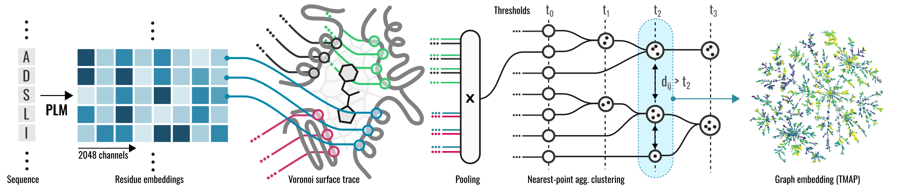

# EPoCS
This package implements EPoCS - an ESM-based Pocket Cross-Similarity metric for the comparison and contextualisation of protein binding sites, as well as systematic debiasing of train-test splits for pocket-centric machine-learning models. EPoCS combines protein language models (specifically, ESM-2) with real-space tesselation to generate vector embeddings for protein binding sites. The embeddings are the basis of the EPoCS similarity metric that gives rise to the _pocket atlas_. See the [bioRxiv](TODO) preprint for details.

<div align="center">
    
</div>

## Installation

For `python3.9`:
```bash
conda create --prefix ./venv python=3.9
conda activate ./venv
conda install -c tmap tmap  # requires python>=3.9,<3.10.0a0
```
For `python>3.9` we need to build `tmap` from source. Also, note that ESM is not officially supported for `python>3.9`.
```bash
conda create --prefix ./venv python=3.12 gcc_linux-64=13.2 gxx_linux-64=13.2
conda activate ./venv
conda install ogdf -c tmap
conda install cmake pillow numpy scipy matplotlib  # some tmap dependencies
pip install git+https://github.com/reymond-group/tmap.git
```
Then, for any `python3`:
```bash
conda install conda-forge::pymol-open-source
pip3 install torch torchvision torchaudio
conda install biopandas pytest scipy tqdm -c conda-forge
pip install fair-esm
pip install faerun
```

## Tests
To verify your installation, run
```
pytest tests/ --esm_parameters_path /path/to/esm2_t36_3B_UR50D.pt
```

## Usage
The input file should include the paths for protein and ligand files in `.cif` or `.pdb` formats. Instead of an explicit ligand input, you can provide a 3D point `(x,y,z)` as reference point for the tesselation. You can set custom paths for file output, see `run_epocs.py --help`. If you run EPoCS for thousands of pockets, make sure to consider disk space requirements in advance.

If downloading the ESM model weights from server is not possible or desirable, you can point to an existing parameter file using `--esm_parameters_path /path/to/esm/weights/esm2_t36_3B_UR50D.pt`.

Example:
```bash
python run_epocs.py -f ./example/pocket_list -pp /path/to/esm2_t36_3B_UR50D.pt -np 8
```

## Citation

The manuscript is available on bioRxiv, please cite if you found the method and/or code useful:
```
@article{oruc_epocs_2024,
    doi = {...},
    url = {...},
    author = {...},
}
```
